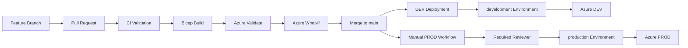
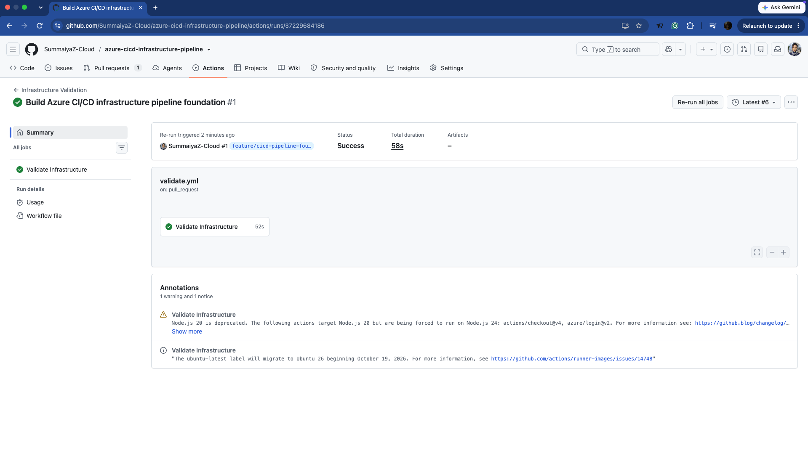
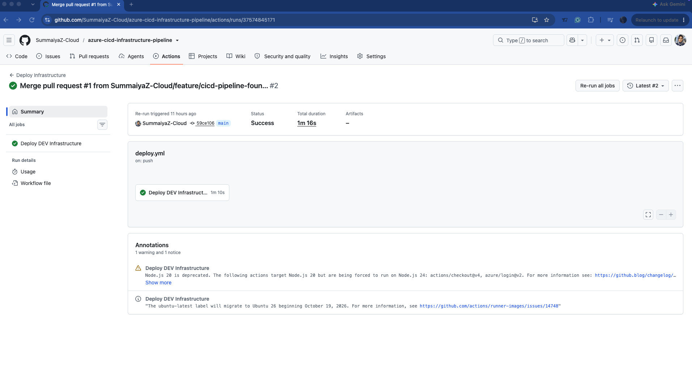
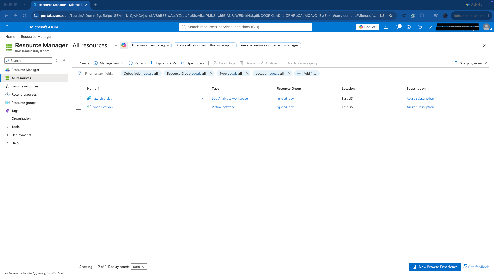
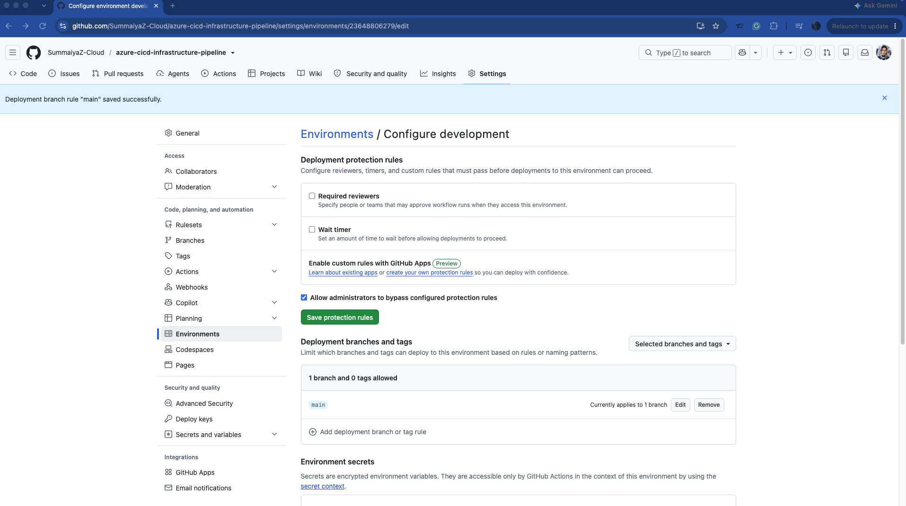
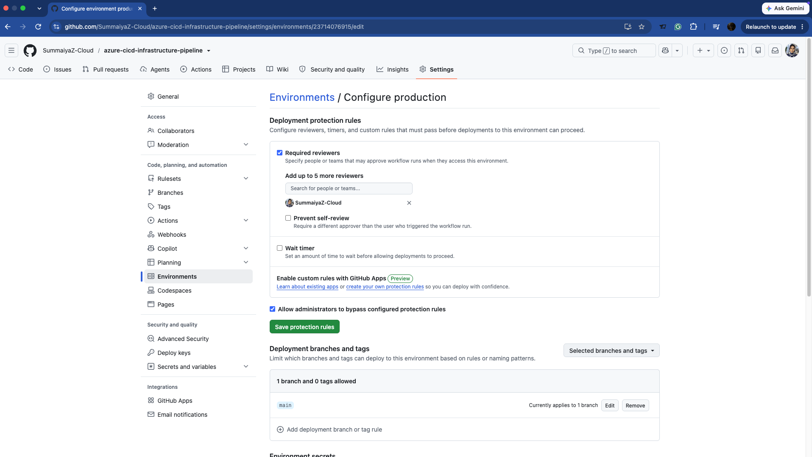
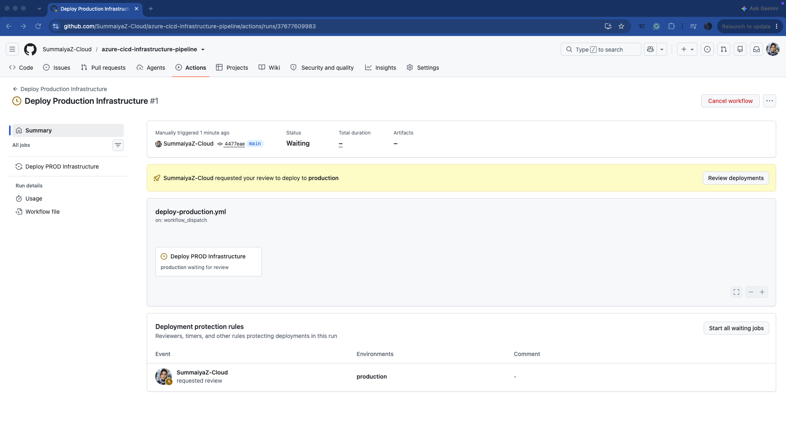

# Azure CI/CD Infrastructure Deployment Pipeline

Production-style CI/CD pipeline for deploying Azure infrastructure with **GitHub Actions, Bicep, Microsoft Entra ID workload identity federation (OIDC), Azure RBAC, deployment validation, What-If analysis, and environment-based deployment controls**.

The project demonstrates a secure infrastructure delivery workflow from feature development through automated DEV deployment and controlled production release.

## Architecture



## Architecture Components

| Component | Purpose |
|---|---|
| GitHub Actions | CI/CD orchestration |
| Azure Bicep | Infrastructure as Code |
| Microsoft Entra ID | Workload identity federation |
| GitHub OIDC | Passwordless Azure authentication |
| Azure RBAC | Resource-group-scoped authorization |
| Azure What-If | Deployment change preview |
| GitHub Environments | DEV/PROD deployment controls |
| Azure Virtual Network | Environment network foundation |
| Log Analytics Workspace | Monitoring foundation |

## Repository Structure

```text
.
├── .github/
│   └── workflows/
│       ├── validate.yml
│       ├── deploy.yml
│       └── deploy-production.yml
├── diagrams/
│   └── architecture.md
├── docs/
│   └── pipeline-design.md
├── infra/
│   ├── modules/
│   │   ├── networking.bicep
│   │   └── monitoring.bicep
│   ├── parameters/
│   │   ├── dev.bicepparam
│   │   └── prod.bicepparam
│   └── main.bicep
├── screenshots/
└── README.md
```

## CI — Pull Request Validation

Infrastructure changes submitted through pull requests to `main` trigger the validation workflow.

The pipeline performs:

- Passwordless Azure authentication through OIDC
- Bicep template compilation
- DEV parameter compilation
- PROD parameter compilation
- Azure Resource Manager deployment validation
- Azure What-If analysis

This provides deployment feedback before infrastructure changes reach `main`.

## CD — Development

Infrastructure changes merged into `main` automatically trigger the DEV deployment workflow when files under `infra/` change.

The workflow:

1. Authenticates to Azure using OIDC.
2. Validates the Bicep deployment.
3. Executes Azure What-If.
4. Deploys the infrastructure to `rg-cicd-dev`.

The GitHub `development` environment restricts deployments to the `main` branch.

## Controlled Production Deployment

Production uses a separate manually triggered workflow.

Controls include:

- GitHub `workflow_dispatch`
- `main` branch deployment restriction
- GitHub `production` environment
- Required reviewer approval
- Dedicated production OIDC federated credential
- Resource-group-scoped Azure RBAC

The production workflow was tested through the approval gate and intentionally cancelled before infrastructure deployment.

This verifies the release control without creating unnecessary production resources.

## Passwordless Azure Authentication

The workflows use **GitHub Actions OIDC federation with Microsoft Entra ID** rather than storing a long-lived Azure client secret.

Federated identity credentials were configured for the different GitHub execution contexts used by the pipeline, including:

- Pull requests
- `main` branch
- Development environment
- Production environment

Azure permissions for the CI/CD identity are scoped to the project resource groups instead of the entire subscription.

## Infrastructure as Code

The Bicep deployment uses reusable modules for networking and monitoring.

### Development

- Resource group: `rg-cicd-dev`
- Virtual network: `vnet-cicd-dev`
- Address space: `10.20.0.0/16`
- Application subnet: `10.20.1.0/24`
- Log Analytics workspace: `law-cicd-dev`

### Production

- Resource group: `rg-cicd-prod`
- Address space: `10.30.0.0/16`
- Application subnet: `10.30.1.0/24`
- Separate production parameter configuration
- Deployment protected by manual approval

## Deployment Safety

The delivery process incorporates multiple controls:

- Feature-branch development
- Pull-request validation
- Bicep compilation
- ARM deployment validation
- Azure What-If
- Separate DEV and PROD parameters
- Passwordless workload identity federation
- Resource-group-scoped RBAC
- GitHub environment restrictions
- Manual production initiation
- Required production reviewer
## Validation Evidence

### Pull Request Infrastructure Validation



### Automated DEV Deployment



### Azure Resources Created by the Pipeline



### Development Environment Restriction



### Production Deployment Protection



### Production Approval Gate



## Deployment Result


The CI/CD implementation successfully:

- Validated infrastructure changes through pull requests.
- Authenticated GitHub Actions to Azure without a stored client secret.
- Deployed the DEV environment automatically after merge to `main`.
- Created the expected Azure networking and monitoring resources.
- Restricted DEV deployment to `main`.
- Protected PROD with a manual trigger and required reviewer.
- Reached the production approval gate without automatically deploying production infrastructure.

## Documentation

Detailed architecture and pipeline design are available in:

- [`diagrams/architecture.md`](diagrams/architecture.md)
- [`docs/pipeline-design.md`](docs/pipeline-design.md)

## Technologies

`Azure` · `Bicep` · `GitHub Actions` · `Microsoft Entra ID` · `OIDC` · `Azure RBAC` · `Azure CLI` · `Azure Virtual Network` · `Log Analytics`
