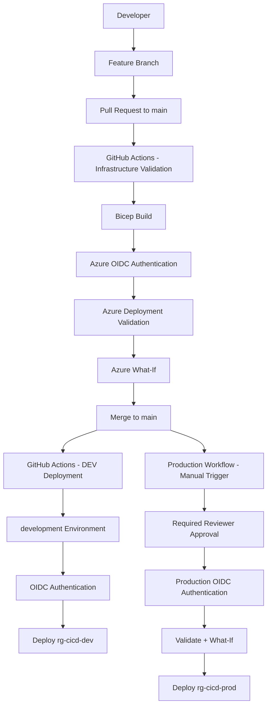

# Azure CI/CD Infrastructure Pipeline Architecture

## Deployment Model

| Stage | Trigger | Authentication | Control | Result |
|---|---|---|---|---|
| CI | Pull request to `main` | GitHub OIDC | Bicep build, Azure validation, What-If | Infrastructure changes validated |
| DEV | Merge/push to `main` | GitHub OIDC | `main`-only environment restriction | Automatic DEV deployment |
| PROD | Manual workflow dispatch | GitHub OIDC | Required reviewer + `main` restriction | Controlled production deployment |

## Security Model

The pipeline uses Microsoft Entra workload identity federation with GitHub Actions OIDC. No long-lived Azure client secret is stored in GitHub.

Azure RBAC is scoped to the DEV and PROD resource groups rather than granting the deployment identity subscription-wide Contributor access.

Separate federated identity credentials support pull-request validation, development deployments, and production deployments.

## Environment Strategy

### Development
- Resource group: `rg-cicd-dev`
- VNet: `10.20.0.0/16`
- Application subnet: `10.20.1.0/24`
- Automatically deployed after validated changes reach `main`

### Production
- Resource group: `rg-cicd-prod`
- VNet: `10.30.0.0/16`
- Application subnet: `10.30.1.0/24`
- Manual workflow trigger
- Required reviewer approval
- Production deployment intentionally not executed during portfolio validation